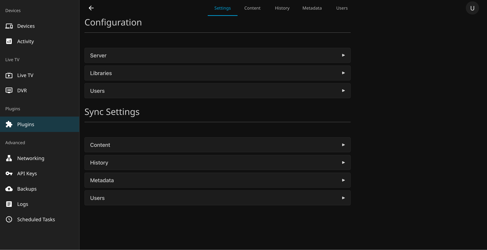
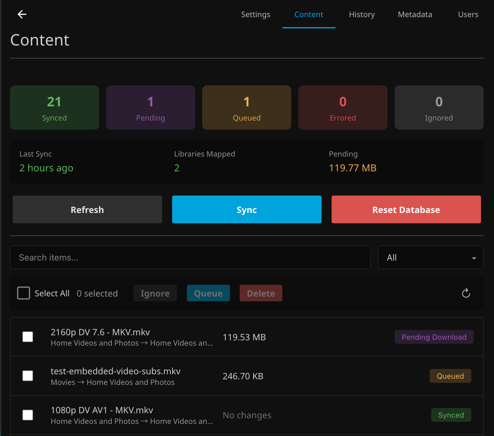

# Server Sync

#### A Jellyfin plugin that enables one-way synchronization from a Source Jellyfin Server to a Local Jellyfin Server. This enables you to not only keep **Content Files** synchronized on multiple servers, but also share **Watch History**, **Metadata**, and **User Settings** as well. The plugin is only required on the Local (destination) Server as all sync tasks are performed using standard Jellyfin APIs.

*This plugin edits live data in your Jellyfin Server. I created this project for my own personal use case which may not align with your own. While this project is tested extensively, I cannot foresee every possibility or server variation. Please ensure that you take backups of your data and Jellyfin Server to protect against issues.*

**You are responsible for your own data security and preservation.**

---

# WORK IN PROGRESS

**THIS IS NOT CURRENTLY READY FOR PRODUCTION USAGE! FEEL FREE TO TEST THIS OUT BUT DO NOT USE THIS FOR ANYTHING CRITICAL!**

**AT THIS TIME THE FOLLOWING IS COMPLETE:**

- **Content Syncing**
- **Histoy Syncing**
- **User Syncing**

**THE FOLLOWING IS INCOMPLETE:**

- **Metadata Syncing**
   - *Images and Metadata sync but array data (Genres, People, Studios, & Tags) does not sync at this time.*

---

# Settings

| Settings Tab |
| :--- |
|  |

## Source Server

The Source Server is the Jellyfin Server you want to sync content **from**. This plugin runs on your Local Server and pulls content from the Source Server.

| Source Server Configuration |
| :--- |
|  |

1. **Generate an API Key** on the source server:
   - Go to **Dashboard > API Keys** on the source server
   - Create a new API key for Server Sync

2. **Configure the plugin** on your local server:
   - **Server URL**: The full URL of the source server (e.g., `http://192.168.1.100:8096`)
   - **API Key**: The API key you generated on the source server

3. **Test the connection** using the "Test" button to verify connectivity

#### Once connected, you'll see the source server's name and ID displayed, confirming the connection is working.

## Library Mapping

| Library Mapping |
| :--- |
|  |

1. **Create a new Library Mapping**

2. **Map your Source Library** to a library on your Local Server:

   - **Library**: Select the Source and Local Libraries that should map to each other
      - *Multiple Source Libraries can be mapped to the same Local Library if desired*

   - **Root Path**: This is the base folder path that the library uses for content
      - *This will take the Source Library file `/media/Track Testing/My Movie (2025)/movie.mp4` and save it to the Local Library at `/media/My Movie (2025)/movie.mp4`*
      - **Only single folder libraries are supported by this plugin.**

#### Once all of the Libraries that you want to map are mapped, save your settings.

## User Mapping [Optional]

| User Mapping |
| :--- |
|  |

1. **Create a new User Mapping**

2. **Map your Source User** to a user on your Local Server
   - *This is only required if you want History or User Syncing*
   - *This NOT required for Content and Metadata Syncing*

#### Once all of the Users that you want to map are mapped, save your settings.

---

# Syncing Types

## Content Syncing

Content Syncing copies media files from the Source Server and mirrors them on your Local Server. This is performed in two steps: **Refresh Sync Table** & **Sync Missing Content**.

| Content Sync Table |
| :--- |
|  |

### Refresh Sync Table

The Plugin builds a table of all content that exists in the mapped Source Libraries. This is compared, **by file path**, against the files that exist on the Local Server. Files that do not exist on the Local Server are Queued *(or set to Pending if `Require Approval` is enabled)*. If files no longer exist on Source Server, they are set to Delete *(this can be disabled in the settings)*.

Files in this table can be manually approved/ignored for Download, Replacement, or Deletion using the Approval Process. Files can also *manually* be deleted from the local server using the Delete functionality.

### Sync Missing Content

Using the files found in the Sync Table, all Queued files *(and companion files such as subtitles & NFOs)* are downloaded using Jellyfin's API into the Temporary Directory. Once downloaded, these files are moved in the mirroring location on the Local Server and any required folders are created. Files with the Pending & Ignored statuses are not processed by this step. Files that are set to Delete are deleted during this step but, to prevent issues, any nested folders left empty by a deletion are not touched.

#### For complete information, please see our **[Content Syncing Documentation](Documentation/Content.md)**!

---

## History Syncing

History syncing enables bidirectional watch history synchronization between servers. The plugin tracks played/unplayed status, play counts, playback positions (resume points), and favorites for each user's items. Using intelligent two-way merge logic, it combines data from both servers: maximum play count, most recent playback position, and preserves played/favorite status if either server has them. History sync requires user mappings and library mappings but operates independently from content sync. 

#### For complete information, please see our **[History Syncing Documentation](Documentation/History.md)**!

---

## Metadata Syncing

Metadata syncing enables one-way synchronization of media metadata from the source server to your local server. The plugin syncs three property categories independently: item metadata (titles, descriptions, ratings, genres, tags, provider IDs), images (posters, backdrops, logos), and people/artist associations. Each category uses intelligent comparison—semantic JSON diffing for metadata properties and SHA256 hash comparison for images. Items are matched by file path using your existing library mappings, the same matching logic used by History Sync. This allows you to curate metadata on a primary server and have secondary servers automatically reflect those changes.

#### For complete information, please see our **[Metadata Syncing Documentation](Documentation/History.md)**!

---

## User Syncing

User syncing enables one-way synchronization of user settings from the source server to your local server. The plugin syncs three property categories independently: user policies (permissions and restrictions), user configuration (preferences), and profile images. Each category can be individually enabled and uses intelligent comparison—semantic JSON diffing for policies/configuration and SHA256 hash comparison for profile images. Library-specific permissions are automatically translated using your library mappings, ensuring access controls work correctly even when library IDs differ between servers.

#### For complete information, please see our **[User Syncing Documentation](Documentation/Users.md)**!

---

# Installation

## Step 1: Add Plugin Repository

* Open Jellyfin and navigate to Dashboard → Plugins → Repositories
* Click Add Repository
* Enter the following repository URL: `https://raw.githubusercontent.com/JPKribs/jellyfin-plugin-serversync/master/manifest.json`
* Click Save

## Step 2: Install Plugin

* Go to the Catalog tab in the Plugins section
* Find Server Sync in the catalog
* Click Install
* Wait for installation to complete

## Step 3: Restart Jellyfin

* Restart your Jellyfin server completely
* Wait for Jellyfin to fully start up

## Verification Check

* After restart, navigate to Dashboard → Plugins → Server Sync to confirm the plugin configuration page loads properly.

---

# AI Disclaimer

Claude Code was utilized for this project to resolve issues with GitHub Actions & Build Scripts. For project code, it was used to locally to cleanup inline comments and create first drafts of documentation.

**All code was written and tested by humans.**
