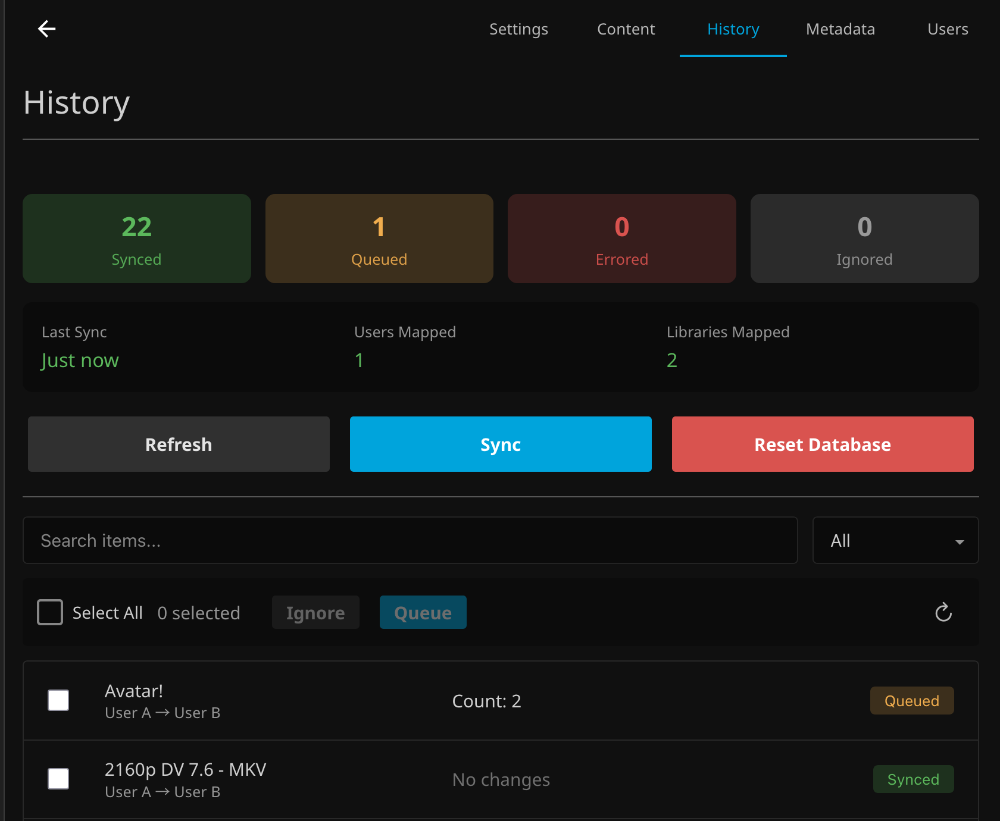
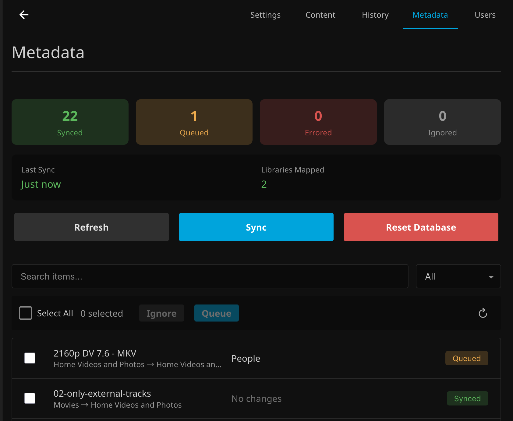
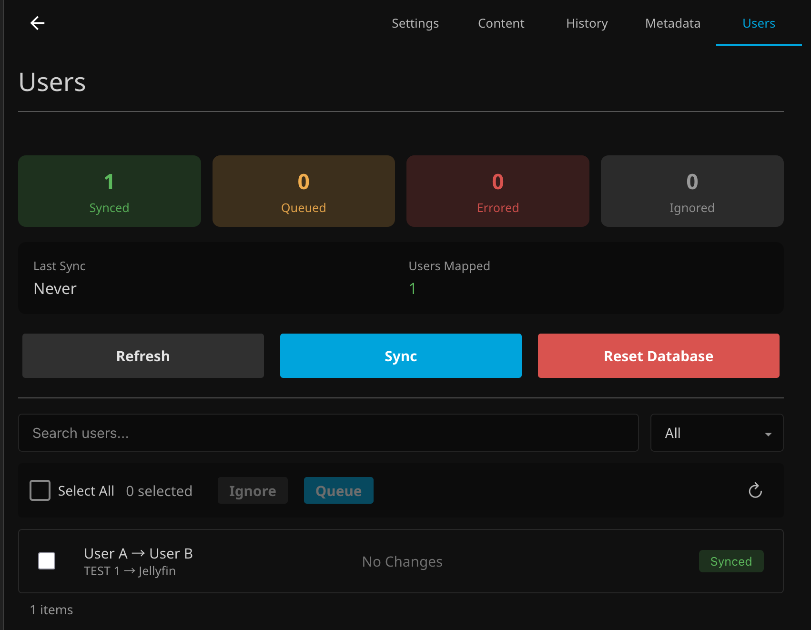

# Server Sync

A Jellyfin plugin for one-way synchronization between Jellyfin servers. Keep your **Content**, **Watch History**, **Metadata**, and **User Settings** in sync across multiple Jellyfin installations.

## How It Works

Server Sync runs on your Local (destination) server and pulls data from a Source server using standard Jellyfin APIs. You configure library and user mappings, then scheduled tasks handle the synchronization. Content is matched by file path, allowing the plugin to track what needs to be downloaded, updated, or removed. No modifications are required on the Source server—just an API key.

## Use At Your Own Risk

This plugin modifies live data on your Jellyfin server. While extensively tested, I cannot account for every server configuration or edge case. **Always maintain backups of your Jellyfin data and configuration.** By using this plugin, you accept full responsibility for any data loss or issues that may occur.

---

# Settings

| Settings Tab |
| :--- |
|  |

## Source Server

The Source Server is the Jellyfin Server you want to sync content **from**. This plugin runs on your Local Server and pulls content from the Source Server.

| Source Server Configuration |
| :--- |
|  |

1. **Generate an API Key** on the source server:
   - Go to **Dashboard > API Keys** on the source server
   - Create a new API key for Server Sync

2. **Configure the plugin** on your local server:
   - **Server URL**: The full URL of the source server (e.g., `http://192.168.1.100:8096`)
   - **API Key**: The API key you generated on the source server

3. **Test the connection** using the "Test" button to verify connectivity

#### Once connected, you'll see the source server's name and ID displayed, confirming the connection is working.

## Library Mapping

| Library Mapping |
| :--- |
|  |

1. **Create a new Library Mapping**

2. **Map your Source Library** to a library on your Local Server:

   - **Library**: Select the Source and Local Libraries that should map to each other
      - *Multiple Source Libraries can be mapped to the same Local Library if desired*

   - **Root Path**: This is the base folder path that the library uses for content
      - *This will take the Source Library file `/media/Track Testing/My Movie (2025)/movie.mp4` and save it to the Local Library at `/media/My Movie (2025)/movie.mp4`*
      - **Only single folder libraries are supported by this plugin.**

#### Once all of the Libraries that you want to map are mapped, save your settings.

## User Mapping [Optional]

| User Mapping |
| :--- |
|  |

1. **Create a new User Mapping**

2. **Map your Source User** to a user on your Local Server
   - *This is only required if you want History or User Syncing*
   - *This NOT required for Content and Metadata Syncing*

#### Once all of the Users that you want to map are mapped, save your settings.

---

# Syncing Types

## Content Syncing

Content Syncing copies media files from the Source Server and mirrors them on your Local Server. This is performed in two steps: **Refresh Sync Table** & **Sync Content**.

| Content Sync Table |
| :--- |
|  |

### Refresh Sync Table

The Plugin builds a table of all content that exists in the mapped Source Libraries. Source Server files are compared, **by file path**, against files on the Local Server. The following content states are tracked:

* Files missing on Local Server are Queued for download *(or Pending if `Require Approval` is enabled)*
* Files no longer on Source Server are set to Delete *(can be disabled in settings)*
* Companion files (subtitles, NFOs, images) are included with their parent media

Files can be manually approved or ignored using the Approval Process.

Setting a file to Ignored will skip any future actions.

### Sync Content

Using the files found in the Sync Table, all Queued files are downloaded using Jellyfin's API into the Temporary Directory. Once downloaded, files are moved to the mirrored location on the Local Server and any required folders are created. Files with the Pending & Ignored statuses are not processed. Files set to Delete are removed during this step.

#### For complete information, please see our **[Content Syncing Documentation](Documentation/Content.md)**!

---

## History Syncing

History Syncing copies watch history from the Source Server and mirrors it on your Local Server. This is performed in two steps: **Refresh Sync Table** & **Sync History**.

| History Sync Table |
| :--- |
|  |

### Refresh Sync Table

The Plugin builds a table of all content that exists on both the Source Server and the Local Server. Source Server watch history is compared, **by file path**, against the Local Server. The following history fields are tracked:

* Played Status (from the most recently played server)
* Play Count (uses the greater value between servers)
* Playback Position (from the most recently played server)
* Last Played Date (from the most recently played server)
* Favorite Status (always taken from Source Server)

Items with history that varies are Queued for import.

Setting a file to Ignored will skip any future actions.

### Sync History

Using the watch history found in the Sync Table, all Queued records update content history using Jellyfin's API.

#### For complete information, please see our **[History Syncing Documentation](Documentation/History.md)**!

---

## Metadata Syncing

Metadata Syncing copies media metadata from the Source Server and mirrors them on your Local Server. This is performed in two steps: **Refresh Sync Table** & **Sync Metadata**.

| Metadata Sync Table |
| :--- |
|  |

### Refresh Sync Table

The Plugin builds a table of all content that exists on both the Source Server and the Local Server. Source Server metadata is compared, **by file path**, against the Local Server. The following metadata categories are tracked individually:

* Metadata (Name, Overview, Ratings, Dates, etc.)
* Genres
* Tags
* Studios
* People (Actors, Directors, Writers)
* Images (Primary, Backdrop, Logo, etc.)

Items with metadata that varies from the Source Server are Queued for import.

Setting a file to Ignored will skip any future actions.

### Sync Metadata

Using the metadata found in the Sync Table, all Queued records update content metadata using Jellyfin's API.

#### For complete information, please see our **[Metadata Syncing Documentation](Documentation/Metadata.md)**!

---

## User Syncing

User Syncing copies user images, settings, and configuration from the Source Server and mirrors them on your Local Server. This is performed in two steps: **Refresh Sync Table** & **Sync Users**.

| User Sync Table |
| :--- |
|  |

### Refresh Sync Table

The Plugin builds a table of all mapped users that exist on both the Source Server and the Local Server. Source Server user configuration is compared against the Local Server. The following user settings are tracked:

* Profile Images
* Policy (permissions and library access, translated to local library IDs)
* Configuration (playback preferences, subtitle mode, display settings)

Users with configuration that varies from the Source Server are Queued for import.

Setting a user to Ignored will skip any future actions.

### Sync Users

Using the user configurations found in the Sync Table, all Queued records update user settings using Jellyfin's API.

#### For complete information, please see our **[User Syncing Documentation](Documentation/Users.md)**!

---

# Installation

## Step 1: Add Plugin Repository

* Open Jellyfin and navigate to Dashboard → Plugins → Repositories
* Click Add Repository
* Enter the following repository URL: `https://raw.githubusercontent.com/JPKribs/jellyfin-plugin-serversync/master/manifest.json`
* Click Save

## Step 2: Install Plugin

* Go to the Catalog tab in the Plugins section
* Find Server Sync in the catalog
* Click Install
* Wait for installation to complete

## Step 3: Restart Jellyfin

* Restart your Jellyfin server completely
* Wait for Jellyfin to fully start up

## Verification Check

* After restart, navigate to Dashboard → Plugins → Server Sync to confirm the plugin configuration page loads properly.

---

# AI Disclaimer

Claude Code was utilized for this project to resolve issues with GitHub Actions & Build Scripts. For project code, it was used to locally to cleanup inline comments and create first drafts of documentation.

**All code was written and tested by humans.**
