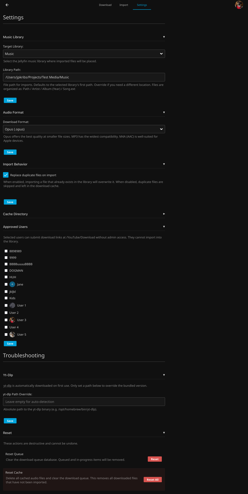
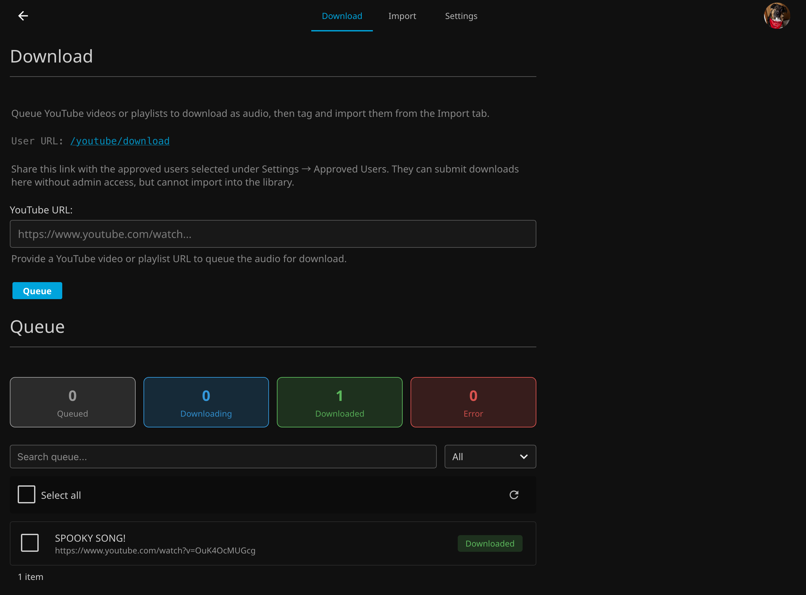
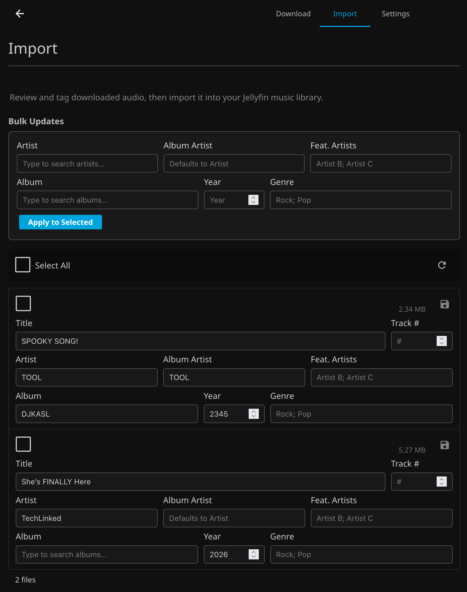

# 

A Jellyfin plugin to download audio tracks from YouTube URLs or playlists. Once downloaded, files are tagged using internal metadata and imported into a local Jellyfin music library.

---

## How It Works
YouTube Audio lets you paste a YouTube video or playlist URL, download the audio using [yt-dlp](https://github.com/yt-dlp/yt-dlp) (auto-downloaded on first use), tag each track with metadata, and import the files directly into your Jellyfin library. Files are organized into Jellyfin's expected directory structure automatically. You configure your target library, preferred audio format, and import behavior in the plugin settings. From there, then the Download & Import workflow handles the rest.

## Use At Your Own Risk
This plugin writes files and metadata to files in your Jellyfin library directory. While extensively tested, I cannot account for every server configuration or edge case. **Always maintain backups of your Jellyfin data and configuration.** By using this plugin, you accept full responsibility for any data loss or issues that may occur.

---

## Getting Started

### 1. Settings

#### Configure the plugin before your first download.

| Settings |
|----------|
|  |

**Music Library** — Select your target Jellyfin music library and confirm the library path. This is the directory where imported files will be placed. Files are organized as:

```
<library path>/Artist/Album (Year)/Song.ext
```

> **Important:** Jellyfin must have write access to this directory for the audio to be copied successfully.

**Audio Format** — Choose your preferred download format:

| Format | Notes |
|--------|-------|
| Opus (.opus) | Best quality at smaller file sizes |
| MP3 (.mp3) | Widest compatibility |
| M4A (.m4a) | Well-suited for Apple devices |

**Import Behavior** — Choose whether importing a file that already exists in the library should overwrite the existing file or skip it (leaving the duplicate in the download cache).

**Cache Directory** — By default, downloaded files are cached in the Jellyfin data directory. Override this if you need a specific staging location.

### 2. Download

#### Queue up audio for download.

| Downloads |
|-----------|
|  |

1. Paste a YouTube video or playlist URL into the input field
2. Click **Queue** to add it to the download queue
3. From the queue, select the items you want to download and click **Download** — or remove any you don't want with **Delete**

### 3. Import

#### Tag your downloaded files and bring them into your library.

| Import |
|--------|
|  |

1. Review and edit metadata for each downloaded file (title, artist, album artist, featured artists, album, year, genre, track number)
2. To apply the same metadata to multiple files at once, fill in the bulk fields at the top and click **Apply to Selected**
3. Remember to save any unsaved changes on individual tracks before importing (look for the save icon)
4. Select the files you want to import and click **Import**

Metadata is written directly to the audio files. On import, files are copied into your music library directory following Jellyfin's expected structure:

```
<library path>/Artist/Album (Year)/Song.ext
```

Successfully imported files are removed from the queue.

---

# Installation

## Step 1: Add Plugin Repository

* Open Jellyfin and navigate to Dashboard → Plugins → Repositories
* Click Add Repository
* Enter the following repository URL: `https://raw.githubusercontent.com/JPKribs/jellyfin-plugin-youtubeaudio/master/manifest.json`
* Click Save

## Step 2: Install Plugin

* Go to the Catalog tab in the Plugins section
* Find YouTube Audio in the catalog
* Click Install
* Wait for installation to complete

## Step 3: Restart Jellyfin

* Restart your Jellyfin server completely
* Wait for Jellyfin to fully start up

## Verification Check

* After restart, navigate to Dashboard → Plugins → Server Sync to confirm the plugin configuration page loads properly.

---

# AI Disclaimer

Claude Code was utilized for this project to resolve issues with GitHub Actions & Build Scripts. For project code, it was used to locally to cleanup inline comments and create first drafts of documentation.

**All code was written and tested by humans.**
